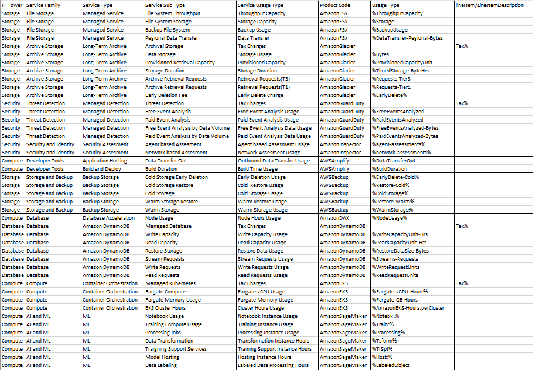

# Лабораторная работа 1. Знакомство с IaaS, PaaS, SaaS сервисами в облаке на примере Amazon Web Services (AWS). Создание сервисной модели. Вариант 8.
## Цель работы: Знакомство с облачными сервисами. Понимание уровней абстракции над инфраструктурой в облаке. Формирование понимания типов потребления сервисов в сервисной-модели. 
## Задание:
1. Импортировать файл .csv в Excel или любую другую программу работы с таблицами. 
2. Распределить потребление сервисов по иерархии, чтобы можно было провести анализ от большего к меньшему.
## Ход работы:
1.Изначально нам предоставлены данные, которые необходимо оценить по 5-и параметрам : IT Tower,	Service Family,	Service Type,	Service Sub Type,	Service Usage Type

IT Tower - представляет собой верхний уровень классификации в иерархии облачных сервисов и обычно соответствует ключевым областям информационных технологий или функциональным блокам. 

Service Family - это группа связанных сервисов, которые имеют схожую функциональность или решают схожие задачи. 

Service Type - уточняет, как именно предоставляется услуга. Это более детализированная категория, которая может описывать, какой именно тип сервиса используется. 

Service Sub Type - представляет собой еще более детализированную категорию, которая уточняет специфику услуги внутри соответствующего типа.

Service Usage Type - описывает, как именно используется услуга и в каких сценариях она востребована. Это позволяет пользователям понять практическое применение сервисов.

2.Далее нам необходимо было заполнить вышеописанные столбцы для сервисов из данных. 

### 1. **Amazon FSx**
Amazon FSx — это управляема услуга файловых систем, которая позволяет развертывать файловые системы на базе Windows или Lustre. Она предоставляет высокую производительность и совместимость с приложениями, использующими стандартные файловые системы.

### 2. **Amazon Glacier**
Amazon Glacier — это услуга облачного хранения, предназначенная для долгосрочного архивации данных. Сервис предлагает низкие цены на хранение с высокой доступностью и безопасностью, однако время доступа к данным может занять от нескольких минут до часов.

### 3. **Amazon GuardDuty**
Amazon GuardDuty — это служба обнаружения угроз, которая использует машинное обучение и анализ поведения, чтобы выявлять подозрительное поведение и потенциальные угрозы в вашей AWS-инфраструктуре.

### 4. **Amazon Inspector**
Amazon Inspector — это служба оценки безопасности, которая автоматически проверяет ваши приложения на наличие уязвимостей и проблем с соответствием стандартам безопасности. Она помогает выявлять риски и предоставляет рекомендации по их устранению.

### 5. **AWS Amplify**
AWS Amplify — это набор инструментов и сервисов для создания мобильных и веб-приложений. Он упрощает процесс разработки, позволяя интегрировать такие функции, как аутентификация, хранилище данных, и API, с минимальными усилиями.

### 6. **AWS Backup**
AWS Backup — это управляема служба резервного копирования для автоматизации резервного копирования данных на AWS. Она позволяет централизованно управлять процессами резервного копирования для различных AWS-ресурсов.

### 7. **Amazon DAX (DynamoDB Accelerator)**
Amazon DAX — это кэш для Amazon DynamoDB, который ускоряет доступ к данным, обеспечивая миллисекундную производительность для операций чтения. Он автоматически управляет кэшированием и упрощает интеграцию с DynamoDB.

### 8. **Amazon DynamoDB**
Amazon DynamoDB — это полностью управляемая NoSQL база данных, обеспечивающая быстрое и предсказуемое время отклика при любой нагрузке. Она поддерживает автоматическое масштабирование и имеет встроенную поддержку репликации и резервного копирования.

### 9. **Amazon EKS (Elastic Kubernetes Service)**
Amazon EKS — это управляема служба Kubernetes, которая упрощает развертывание и управление контейнеризованными приложениями. EKS интегрируется с другими сервисами AWS для обеспечения безопасности и масштабируемости.

### 10. **Amazon SageMaker**
Amazon SageMaker — это сервис, который позволяет разработчикам и дата-сайентистам создавать, обучать и развертывать модели машинного обучения. Он предоставляет инструменты для обработки данных, обучения и оценки моделей без необходимости управлять инфраструктурой.

Вот полученный результат:

Таблица файлом находится в этом же репозитории под названием "AWS_8_Done.csv"
