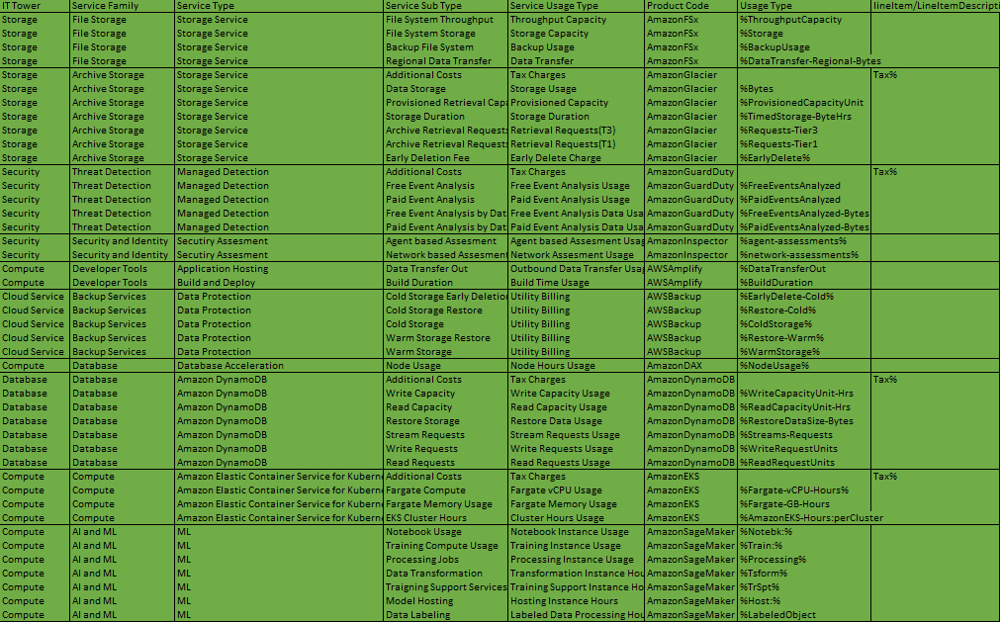

# Лабораторная работа 1: Облачные сервисы AWS - Знакомство с моделями IaaS, PaaS и SaaS. Создание сервисной модели. Вариант 8

### Цель и задачи лабораторной работы
Цель - Изучить облачные технологии, освежить понятие уровней абстракции инфраструктуры, а также просмотреть различные варианты использования сервисов в рамках облачной модели.

Задачи - загрузить данные из .csv файла и упорядочить сервисы по иерархии.
### Ход выполнения работы
#### 1. Анализ данных
Были рассмотрены пять ключевых параметров для анализа облачных сервисов:
- **IT Tower**: основная категория, показывающая уровни классификации в IT.
- **Service Family**: группировка схожих по функциям сервисов.
- **Service Type**: более узкая характеристика, уточняющая способ предоставления услуги.
- **Service Sub Type**: подкатегория, обозначающая специфические аспекты услуги.
- **Service Usage Type**: анализирует сценарии и способы использования сервиса.

#### 2. Заполнение таблицы
Далее была проведена работа по заполнению данных для перечисленных сервисов:

### 1. **Amazon FSx**
Контролируемая служба файловых систем, поддерживающая Windows и Lustre, обеспечивающая высокую производительность.

### 2. **Amazon Glacier**
Услуга для долгосрочного хранения данных с доступными ценами и высокой безопасностью.

### 3. **Amazon GuardDuty**
Служба, использующая алгоритмы машинного обучения для обнаружения угроз и подозрительного поведения в AWS.

### 4. **Amazon Inspector**
Автоматическая оценка безопасности приложений, выявляющая уязвимости и риски.

### 5. **AWS Amplify**
Сервис, предоставляющий инструменты для быстрой разработки веб- и мобильных приложений с необходимыми функциями.

### 6. **AWS Backup**
Управляемая служба резервного копирования, которая автоматизирует процесс для различных ресурсов AWS.

### 7. **Amazon DAX (DynamoDB Accelerator)**
Кэш для DynamoDB, увеличивающий производительность операций чтения и упрощающий кэширование данных.

### 8. **Amazon DynamoDB**
Полностью управляемая NoSQL база данных с быстрым временем отклика и поддержкой автоматического масштабирования.

### 9. **Amazon EKS (Elastic Kubernetes Service)**
Сервис для управления контейнеризованными приложениями, интегрирующийся с другими  решениями AWS для повышения безопасности.

### 10. **Amazon SageMaker**
Сервис, позволяющий разработчикам и аналитикам создавать и обучать модели машинного обучения без управления инфраструктурой.

### Итоговые результаты
В процессе работы была составлена итоговая таблица, детализирующая все исследуемые данные:

Файл таблицы доступен в репозитории под названием "AWS_8_ReReDone.csv".

### Источники:
https://docs.aws.amazon.com/ - официальная документация Amazon.

https://tproger.ru/translations/aws-in-plain-russian - статья с форума Tproger
